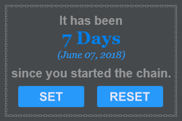

# Don't Break The Chain Rainmeter Skin

## Description
"Don't Break the Chain" is a productivity tip which was devised (to my knowledge) by Jerry Seinfeld.  The essence of the tip is that chains of activity are rewarding in their own right and are harder to break when tracked.  By doing a given activity and working toward a goal every day, each day you add another day onto the chain.  As the chain builds, you don't want to break it so even if you aren't feeling motivated you will put more time into it in order to not break the chain, which in turn gets you closer to your goal.  Seeing the days piling up is also very satisfying and a good motivator on its own, separate from the end goal.  You may read more about the methodology [here](https://www.writersstore.com/dont-break-the-chain-jerry-seinfeld/) and [here](https://lifehacker.com/281626/jerry-seinfelds-productivity-secret).

This Rainmeter skin helps to keep track of chains, whether to maintain a productivity streak or to help with quitting an addiction.  While crossing off days on a calendar is extremely satisfying, a more concise visualization is presented here.

## Installation

The automatic installation instructions on the Rainmeter website (found [here](https://docs.rainmeter.net/manual/installing-skins/)) apply.  Download the desired skin release (releases found [here](https://github.com/kazeraniman/dont-break-the-chain-skin/releases)), double-click the .rmskin file, then follow the on-screen instructions to install.

## The Skin

    

In the default mode, a counter of the days in the chain is presented along with the date the chain was started as a reminder.  When the skin is launched for the first time, the chain is set to start on midnight of the current day.  To set the started date to another time, you simply press the start button to move to set mode.

    

From here the arrows may be used to select the appropriate starting date (the time will always be set to midnight for consistency and nice day tracking).  The date will default to the current day for a nice point of reference.  Once the desired date is set, you may confirm to apply the selected date.  You may also cancel the operation.  Keep in mind that dates in the future may not be applied as that would not make sense for chain tracking.

    

We all break the chain sometimes, and while the set button may work for this use case, it is important enough to merit its own button.  Pressing the reset button will ask for confirmation before applying the reset and resetting the chain to midnight of the current day.

    

